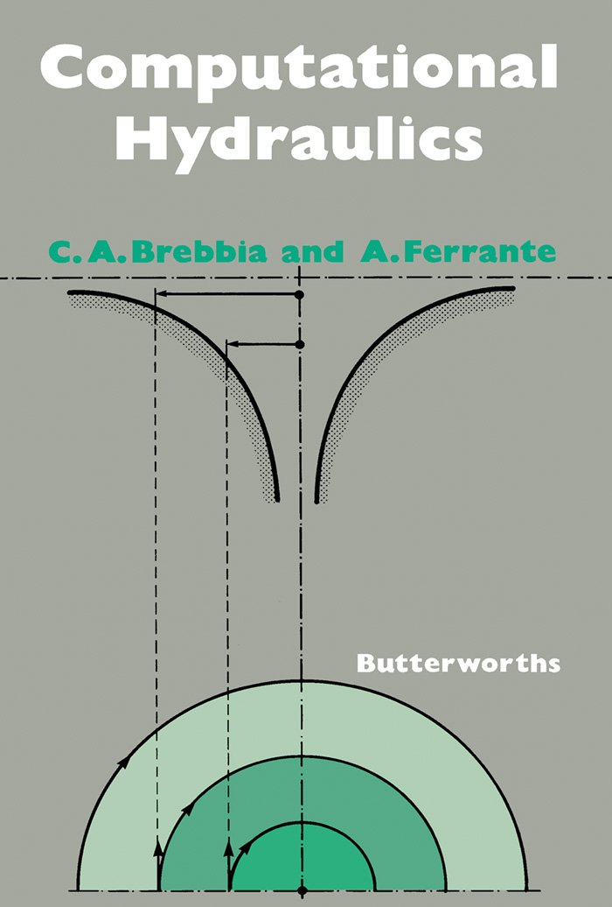
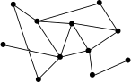
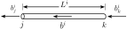

# Net Simulation

Python program based on the code from the book:
- Brebbia, C. A., & Ferrante, A. J. (2013). Computational hydraulics. Butterworth-Heinemann.

## Introduction

Net Simulation is a code that solves systems connected by one-dimensional elements, as shown in the figure:

where the one-dimensional element is represented as follows:

Each element of the system is mathematically related as shown below, using the local matrix of the element:

$$
\begin{bmatrix}
b_{k}^{i} \\ 
b_{j}^{i}
\end{bmatrix} = k^{i}
\begin{bmatrix}
1 & -1 \\ 
-1 & 1
\end{bmatrix}
\begin{bmatrix}
x_{k}^{i} \\ 
x_{j}^{i}
\end{bmatrix}
$$

where $x_{k}^{i}$ and $x_{j}^{i}$ are the unknowns, $b_{k}^{i}$, $b_{j}^{i}$ and $k^i$ are constants.
Each system of one-dimensional elements contains a certain number of nodes and elements. Considering that each element has an associated local matrix, a global matrix of the entire system can be obtained. This matrix is formed according to the connectivity of the elements. This global matrix is represented as follows:

$$ \mathbf{A} \mathbf{x} = \mathbf{b} $$

There are problems where the matrix $\mathbf{A}$ depends on the values of the unknowns stored in the vector $\mathbf{x}$. These cases correspond to nonlinear problems. Net Simulation allows solving this type of nonlinear problems, which are represented as follows:

$$ \mathbf{A}\left(\mathbf{x}\right) \mathbf{x} = \mathbf{b} $$ 

where the global matrix $\mathbf{A}\left(\mathbf{x}\right)$ is a function of the vector $\mathbf{x}$

## Requirements

The code works for me with the following:

- python 3.7.0
- numpy 1.21.5
- scipy 1.4.1
- numba 0.55.1
- matplotlib 3.5.3

## Improvements

The improvements compared to the code in Brebbia's book are mentioned below:

- The matrices are stored in CSR format, using the scipy.sparse library.
- The system of equations in linear problems can be solved using the full variety of Scipy solvers.
- When solving the system of equations, the matrices are partitioned.
- There is no limitation that node 1 must necessarily be a flow entry node. You can freely select any node with any boundary condition.
- Nonlinear problems can be solved using the full range of scipy.optimize.minimize optimizers.
